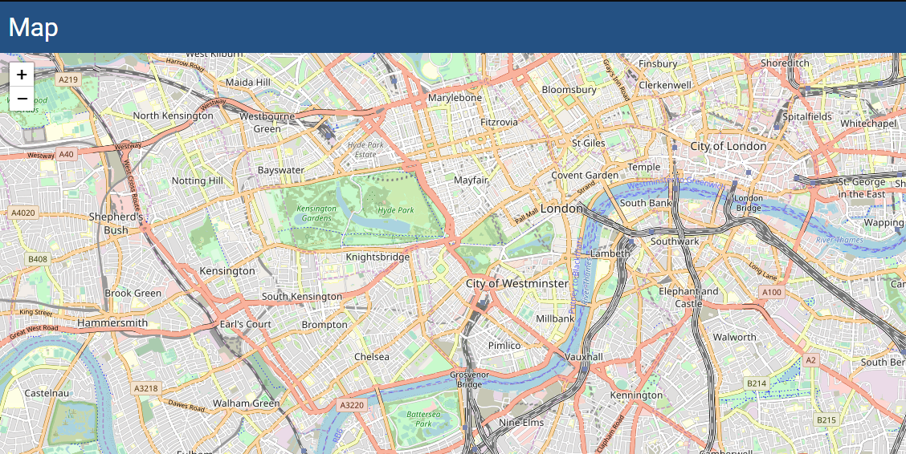

# UDMap 

A Universal Dashboard control wrapper for `react-leaflet`.

# Example 

```
New-UDMap -Latitude 51.505 -Longitude -0.09 -Zoom 13
```



# Properties

## Properties
| name | description | default |
|------|-------------|---------|
|`Latitude`|latitude value|n/a|
|`Longitude`|longitude value|n/a|
|`Zoom`|level of zoom on the map|n/a|
|`Height`|height of map|`500px`|
|`Width`|width of map|`100%`|